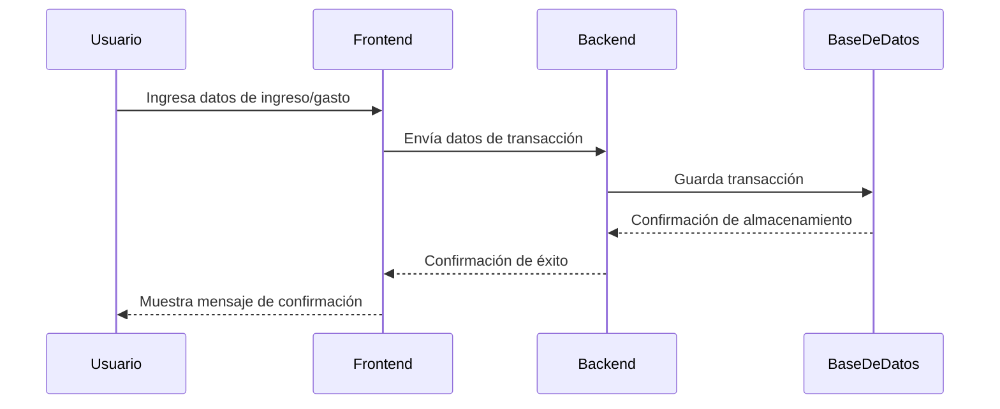
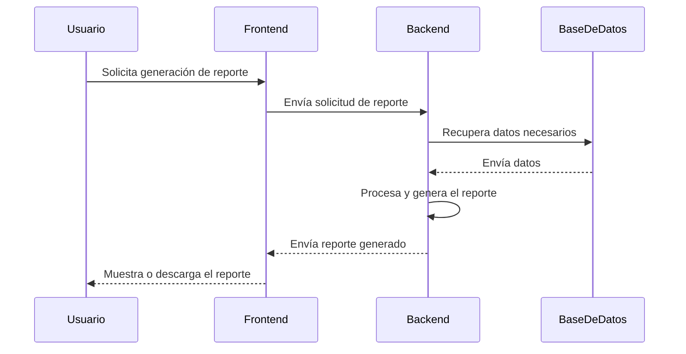
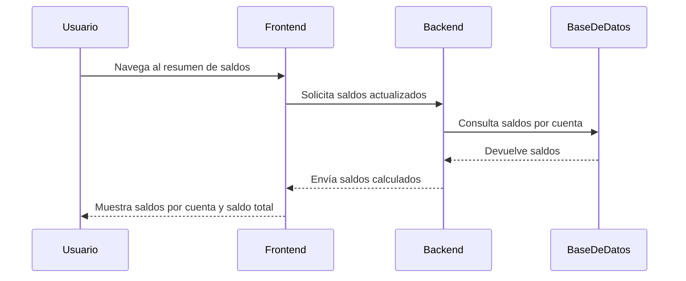
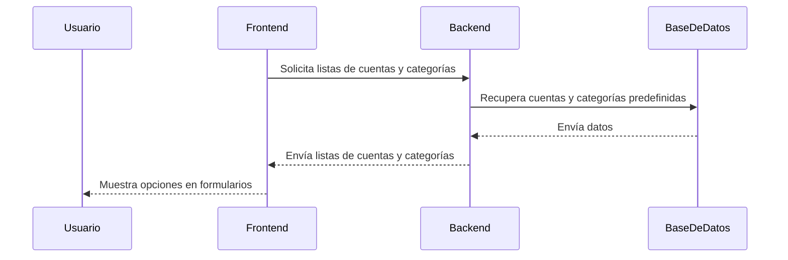
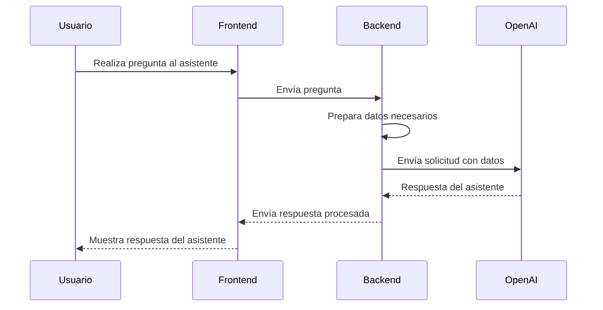

## Índice

0. [Ficha del proyecto](#0-ficha-del-proyecto)
1. [Descripción general del producto](#1-descripción-general-del-producto)
2. [Arquitectura del sistema](#2-arquitectura-del-sistema)
3. [Modelo de datos](#3-modelo-de-datos)
4. [Especificación de la API](#4-especificación-de-la-api)
5. [Historias de usuario](#5-historias-de-usuario)
6. [Tickets de trabajo](#6-tickets-de-trabajo)
7. [Pull requests](#7-pull-requests)

---

## 0. Ficha del proyecto

### **0.1. Tu nombre completo:**
"**William Bastidas**"

### **0.2. Nombre del proyecto:**
"**FlujoAI**"

### **0.3. Descripción breve del proyecto:**

**FlujoAI** es una aplicación web diseñada para pequeños emprendedores que buscan simplificar y automatizar la gestión de su flujo de caja. La plataforma combina una interfaz intuitiva con inteligencia artificial para facilitar el registro de transacciones, cálculo de saldos, generación de reportes y ofrecer recomendaciones financieras personalizadas.

### **0.4. URL del proyecto:**

> Puede ser pública o privada, en cuyo caso deberás compartir los accesos de manera segura. Puedes enviarlos a [alvaro@lidr.co](mailto:alvaro@lidr.co) usando algún servicio como [onetimesecret](https://onetimesecret.com/).

### 0.5. URL o archivo comprimido del repositorio

> Puedes tenerlo alojado en público o en privado, en cuyo caso deberás compartir los accesos de manera segura. Puedes enviarlos a [alvaro@lidr.co](mailto:alvaro@lidr.co) usando algún servicio como [onetimesecret](https://onetimesecret.com/). También puedes compartir por correo un archivo zip con el contenido


---

## 1. Descripción general del producto

> Describe en detalle los siguientes aspectos del producto:

### **1.1. Objetivo:**

El objetivo de **FlujoAI** es proporcionar a los pequeños emprendedores una herramienta sencilla y potente para gestionar eficientemente su flujo de caja. A través de la automatización y el uso de inteligencia artificial, la aplicación busca:

- **Simplificar la gestión financiera**, permitiendo el registro fácil de ingresos y gastos.
- **Ofrecer información financiera en tiempo real**, mostrando saldos actualizados por cuenta y un saldo total consolidado.
- **Facilitar la toma de decisiones informadas**, generando reportes automáticos y proporcionando predicciones y recomendaciones personalizadas.
- **Ahorrar tiempo y reducir la complejidad**, reemplazando hojas de cálculo manuales por una solución integrada y amigable.

### **1.2. Características y funcionalidades principales:**

> Enumera y describe las características y funcionalidades específicas que tiene el producto para satisfacer las necesidades identificadas.

**FlujoAI** ofrece las siguientes características y funcionalidades para satisfacer las necesidades de los emprendedores:

1. **Registro Simplificado de Ingresos y Gastos:**

   - **Interfaz Intuitiva:** Permite ingresar ingresos y gastos de manera rápida y sencilla.
   - **Precarga de Cuentas y Categorías:** Incluye una lista predefinida de cuentas bancarias, conceptos de gastos y productos para agilizar el proceso de registro.

2. **Cálculo Automático de Saldos:**

   - **Balances en Tiempo Real:** Muestra saldos actualizados por cada cuenta y un saldo total consolidado.
   - **Visualizaciones Gráficas:** Ofrece gráficos básicos que ayudan a comprender la situación financiera de un vistazo.

3. **Generación de Reportes Automáticos:**

   - **Reportes Mensuales y Históricos:** Genera informes detallados del mes actual y de períodos anteriores.
   - **Exportación a PDF:** Permite descargar los reportes en formato PDF para su revisión o presentación.

4. **Integración con Inteligencia Artificial:**

   - **Asistente Inteligente:** Un asistente virtual que responde preguntas sobre el flujo de caja, como "¿Cuál fue mi gasto más alto este mes?" o "¿Qué recomendaciones tienes para mejorar mi flujo de caja?".
   - **Recomendaciones Personalizadas:** Utiliza la API de OpenAI para analizar los datos financieros y proporcionar consejos adaptados al negocio.
   - **Predicciones de Flujo de Caja:** Ofrece proyecciones futuras basadas en datos históricos y tendencias actuales.

5. **Precarga de Cuentas y Conceptos de Gastos:**

   - **Facilidad de Configuración:** Al iniciar, el usuario tiene acceso a una lista de cuentas y categorías comunes, lo que simplifica la configuración inicial.
   - **Personalización:** Posibilidad de añadir o modificar cuentas y categorías según las necesidades específicas del negocio.

6. **Interfaz de Usuario Atractiva y Fácil de Usar:**

   - **Diseño Moderno:** Una interfaz visualmente atractiva que mejora la experiencia del usuario.
   - **Navegación Intuitiva:** Menús y flujos de trabajo diseñados para facilitar el uso incluso a usuarios con poca experiencia tecnológica.

7. **Bajo Costo y Mantenimiento Sencillo:**

   - **Eficiencia en Recursos:** La aplicación está optimizada para ser rápida y ligera, reduciendo costos operativos.
   - **Escalabilidad:** Diseñada para crecer con el negocio, adaptándose a un mayor volumen de transacciones sin perder rendimiento.

---

Estas funcionalidades permiten a **FlujoAI** cumplir con su objetivo de simplificar y optimizar la gestión financiera para pequeños emprendedores, ofreciendo herramientas avanzadas sin la complejidad de los sistemas tradicionales.

### **1.3. Diseño y experiencia de usuario:**

> Proporciona imágenes y/o videotutorial mostrando la experiencia del usuario desde que aterriza en la aplicación, pasando por todas las funcionalidades principales.

### **1.4. Instrucciones de instalación:**
> Documenta de manera precisa las instrucciones para instalar y poner en marcha el proyecto en local (librerías, backend, frontend, servidor, base de datos, migraciones y semillas de datos, etc.)

---

## 2. Arquitectura del Sistema


### **1. Diagrama de Secuencia para Carga de Ingresos/Gastos**

  




---

### **2. Diagrama de Secuencia para Generación de Reportes**




---

### **3. Diagrama de Secuencia para Cálculo de Saldos**




---

### **4. Diagrama de Secuencia para Precarga de Cuentas y Conceptos de Gastos**




---

### **5. Diagrama de Secuencia para Interacción Completa con Asistente de IA**





### **2.1. Diagrama de arquitectura:**
> Usa el formato que consideres más adecuado para representar los componentes principales de la aplicación y las tecnologías utilizadas. Explica si sigue algún patrón predefinido, justifica por qué se ha elegido esta arquitectura, y destaca los beneficios principales que aportan al proyecto y justifican su uso, así como sacrificios o déficits que implica.


### **1. Visión General de la Arquitectura**

La arquitectura propuesta es una aplicación web basada en una arquitectura de tres capas:

1. **Frontend:** Angular.
2. **Backend API:** Node.js con Express.js.
3. **Base de Datos:** PostgreSQL.

Además, se integrará con la **API de OpenAI** para las funcionalidades de inteligencia artificial.

---

### **2. Componentes Principales y Sus Interacciones**

#### **a. Frontend (Angular)**

- **Responsabilidades:**
  - Interfaz de usuario para la gestión de ingresos y gastos.
  - Visualización de saldos y reportes.
  - Interfaz para interactuar con el asistente de IA.
- **Comunicación:**
  - Se comunica con el backend a través de llamadas HTTP/HTTPS (RESTful APIs).

#### **b. Backend API (Node.js con Express.js)**

- **Responsabilidades:**
  - Exponer endpoints RESTful para las operaciones CRUD (Crear, Leer, Actualizar, Eliminar).
  - Gestionar la lógica de negocio, como cálculos de saldos y generación de reportes.
  - Autenticación y autorización básica (si es necesario para el MVP).
  - Integración con la API de OpenAI para las funcionalidades de IA.
- **Comunicación:**
  - Recibe solicitudes del frontend y responde con datos en formato JSON.
  - Se conecta con la base de datos PostgreSQL mediante un ORM (por ejemplo, Sequelize).

#### **c. Base de Datos (PostgreSQL)**

- **Justificación de Elección:**
  - **Facilidad de Gestión:** Amplio soporte, documentación y herramientas como pgAdmin.
  - **Relacional:** Ideal para mantener integridad y relaciones entre tablas (usuarios, transacciones, cuentas).
  - **Escalabilidad Vertical y Horizontal:** Capaz de manejar crecimiento en datos y usuarios.
- **Responsabilidades:**
  - Almacenar datos de usuarios, transacciones, cuentas y configuraciones.
  - Garantizar la integridad y consistencia de los datos.

#### **d. Integración con API de OpenAI**

- **Ubicación en la Arquitectura:**
  - Desde el backend (Node.js), se realizan llamadas a la API de OpenAI.
- **Responsabilidades:**
  - Procesar solicitudes del frontend relacionadas con IA.
  - Enviar datos relevantes a OpenAI y retornar las respuestas al frontend.
- **Seguridad:**
  - Las claves de API y lógica sensible se mantienen en el backend para mayor seguridad.

---

### **3. Diagrama de Arquitectura (Representación Textual)**

```
[Usuario]
   |
[Frontend - Angular]
   |
[Backend API - Node.js/Express]
   |          | 
   |          +--> [API de OpenAI]
   |
[Base de Datos - PostgreSQL]
```

**Descripción del Flujo:**

1. **Gestión de Ingresos y Gastos:**

   - El usuario interactúa con la interfaz de Angular para ingresar datos.
   - Angular envía una solicitud HTTP al backend con la información de ingresos/gastos.
   - El backend procesa la solicitud, aplica la lógica de negocio si es necesario, y guarda/actualiza los datos en PostgreSQL.

2. **Cálculo de Saldos:**

   - El frontend solicita los saldos al backend.
   - El backend consulta la base de datos, calcula los saldos por cuenta y el saldo total.
   - Devuelve los datos al frontend para su visualización.

3. **Generación de Reportes:**

   - El usuario solicita un reporte desde la interfaz.
   - El backend genera el reporte, recopilando y procesando los datos necesarios de PostgreSQL.
   - El reporte es enviado al frontend, posiblemente en formato PDF o JSON para ser renderizado.

4. **Precarga de Cuentas y Conceptos de Gastos:**

   - Al iniciar, el frontend solicita al backend las listas de cuentas y conceptos predefinidos.
   - El backend obtiene esta información de PostgreSQL y la envía al frontend.

5. **Integración con IA:**

   - El usuario interactúa con el asistente inteligente desde el frontend.
   - Las solicitudes son enviadas al backend.
   - El backend prepara los datos necesarios y realiza una llamada a la API de OpenAI.
   - La respuesta de OpenAI es procesada en el backend y enviada al frontend para mostrarla al usuario.

---

### **4. Detalles Adicionales de la Arquitectura**

#### **a. Escalabilidad**

- **Backend y API:**
  - La aplicación Node.js puede ser escalada horizontalmente utilizando balanceadores de carga.
- **Base de Datos:**
  - PostgreSQL soporta replicación y particionamiento para manejar grandes volúmenes de datos.
- **Consideraciones:**
  - Utilizar contenedores (Docker) para facilitar el despliegue y escalabilidad.
  - Implementar servicios en la nube como Heroku o DigitalOcean para desplegar aplicaciones Node.js y bases de datos PostgreSQL de manera sencilla.

#### **b. Bajo Costo y Mantenimiento Sencillo**

- **Infraestructura:**
  - Utilizar servicios PaaS (Platform as a Service) que ofrecen planes gratuitos o de bajo costo para MVPs.
- **Gestión de Base de Datos:**
  - Herramientas como pgAdmin simplifican la administración de PostgreSQL.
  - Configurar backups automáticos y monitoreo básico.

#### **c. Test-Driven Development (TDD)**

- **Enfoque:**
  - Escribir pruebas unitarias y de integración antes o durante el desarrollo de las funcionalidades.
- **Herramientas:**
  - **Para Node.js:** Mocha, Chai, Jest.
  - **Para Angular:** Jasmine, Karma.
- **Beneficios:**
  - Garantiza que cada componente funcione correctamente.
  - Facilita futuros cambios y refactorizaciones.

---

### **5. Desglose de Funcionalidades Clave en la Arquitectura**

#### **1. Gestión de Ingresos y Gastos**

- **Frontend:**
  - Formularios para ingresar datos de transacciones.
  - Validaciones básicas (campos requeridos, formatos numéricos).
- **Backend:**
  - Endpoints RESTful para crear, leer, actualizar y eliminar transacciones.
  - Validaciones adicionales y manejo de errores.
- **Base de Datos:**
  - Tablas para transacciones, cuentas y categorías.

#### **2. Cálculo de Saldos por Cuenta y Saldo Total**

- **Backend:**
  - Funciones que suman y agrupan transacciones por cuenta.
- **Optimización:**
  - Uso de consultas SQL eficientes para minimizar la carga.
- **Frontend:**
  - Visualización de los saldos en tiempo real o al solicitarlo.

#### **3. Generación de Reportes Automáticos**

- **Backend:**
  - Endpoints que generan reportes basados en parámetros (fecha, cuenta, etc.).
  - Posibilidad de generar archivos PDF utilizando librerías como pdfkit.
- **Frontend:**
  - Interfaz para seleccionar períodos y opciones de reporte.
  - Descarga o visualización de reportes.

#### **4. Precarga de Cuentas y Conceptos de Gastos**

- **Base de Datos:**
  - Tablas prellenadas con cuentas y categorías comunes.
- **Backend:**
  - Endpoints para obtener listas de cuentas y categorías.
- **Frontend:**
  - Al iniciar, cargar estas listas para usarlas en formularios.

#### **5. Integración con IA para Reportes, Predicciones y Recomendaciones**

- **Backend:**
  - Funciones que preparan datos y hacen llamadas a la API de OpenAI.
  - Manejo de las respuestas y conversión a un formato utilizable por el frontend.
- **Seguridad:**
  - Las claves de la API de OpenAI se almacenan de forma segura en el backend.
- **Frontend:**
  - Interfaz de chat o secciones donde se muestran las recomendaciones y predicciones.

---

### **6. Justificación de la Elección Tecnológica**

#### **Node.js con Express.js**

- **Ventajas:**
  - **Facilidad de Uso:** Similaridad en lenguaje (JavaScript) entre frontend y backend.
  - **Gran Comunidad y Soporte:** Amplia cantidad de recursos y paquetes disponibles.
  - **Rendimiento:** Capaz de manejar múltiples solicitudes concurrentes eficientemente.

#### **PostgreSQL**

- **Ventajas:**
  - **Robustez y Fiabilidad:** Reconocida por su estabilidad y conformidad con estándares SQL.
  - **Facilidad de Gestión:** Amplias herramientas y recursos para administración.
  - **Características Avanzadas:** Soporte para procedimientos almacenados, funciones, vistas materializadas, etc.

---

### **7. Consideraciones para el Desarrollo**

#### **a. Implementación Rápida**

- **Uso de Generadores y Plantillas:**
  - Herramientas como Express Generator para configurar rápidamente el backend.
- **ORM:**
  - Utilizar Sequelize para interactuar con PostgreSQL, lo que simplifica las operaciones de base de datos.

#### **b. Seguridad Básica**

- **Manejo de Errores y Validaciones:**
  - Implementar validaciones en backend para garantizar integridad.
- **Protección de la API:**
  - Aunque el login no es prioritario, se puede implementar una clave de API básica para proteger los endpoints.

#### **c. Despliegue**

- **Hosting:**
  - Utilizar plataformas como Heroku (que soporta Node.js y PostgreSQL) para un despliegue rápido y sencillo.
- **CI/CD:**
  - Configurar pipelines básicos para automatizar pruebas y despliegues.

#### **d. TDD en la Práctica**

- **Proceso:**
  - Escribir pruebas para cada endpoint y componente antes o durante su desarrollo.
- **Cobertura:**
  - Asegurarse de que las pruebas cubran casos de éxito y manejo de errores.

---

### **8. Resumen**

La arquitectura propuesta equilibra la necesidad de construir un MVP robusto en un tiempo limitado con la facilidad de gestión y escalabilidad futura. Al utilizar tecnologías conocidas y bien soportadas como Node.js y PostgreSQL, se facilita el desarrollo y mantenimiento del backend. La integración con la API de OpenAI se maneja de forma segura y eficiente desde el backend, proporcionando las funcionalidades de IA requeridas.

---

### **9. Próximos Pasos**

1. **Configuración del Entorno de Desarrollo:**

   - Inicializar el proyecto de Node.js con Express.js.
   - Configurar la conexión a PostgreSQL y el ORM Sequelize.
   - Configurar el proyecto de Angular y establecer comunicación con el backend.

2. **Desarrollo Basado en TDD:**

   - Definir los casos de prueba para cada funcionalidad clave.
   - Implementar las funcionalidades asegurando que pasen las pruebas.

3. **Integración con OpenAI:**

   - Configurar las credenciales y endpoints necesarios.
   - Implementar llamadas de prueba y manejar respuestas.

4. **Despliegue y Pruebas:**

   - Desplegar el MVP en un entorno accesible para la presentación.
   - Realizar pruebas de rendimiento y funcionalidad.

---

**Nota:** Esta arquitectura está diseñada para cumplir con los requerimientos específicos del MVP, manteniendo un equilibrio entre rapidez de desarrollo, robustez y facilidad de gestión. La elección de tecnologías y enfoques considera tu experiencia actual y los objetivos del proyecto.

---

### **2.2. Descripción de componentes principales:**

> Describe los componentes más importantes, incluyendo la tecnología utilizada
---

**Descripción Detallada de los Componentes Principales del Sistema**

---

### **1. Frontend: Angular**

**Tecnología:** Angular (versión estable actual)

**Descripción:**

El frontend es la capa de presentación del sistema, responsable de la interacción directa con el usuario. Utilizando Angular, una plataforma robusta basada en TypeScript, se desarrollará una interfaz de usuario dinámica y responsiva que permitirá a los emprendedores gestionar sus finanzas de manera intuitiva y eficiente.

**Funciones Principales:**

- **Interacción del Usuario:**
  - **Formularios de Ingreso de Datos:** Permiten a los usuarios registrar ingresos y gastos de forma sencilla, seleccionando cuentas y categorías precargadas.
  - **Visualización de Saldos:** Muestra saldos actualizados por cuenta y un saldo total consolidado en tiempo real.
  - **Generación de Reportes:** Facilita la generación y visualización de reportes mensuales y de períodos anteriores.
  - **Asistente de IA Integrado:** Interfaz para interactuar con el asistente inteligente, donde el usuario puede hacer preguntas y recibir recomendaciones.

- **Conexión con el Backend:**
  - **Servicios HTTP:** Utiliza el módulo `HttpClient` de Angular para comunicarse con la API RESTful del backend.
  - **Manejo de Peticiones Asíncronas:** Gestiona solicitudes y respuestas de manera eficiente para una experiencia de usuario fluida.

**Características Clave:**

- **Componentes Reutilizables:**
  - Estructura modular que facilita el mantenimiento y escalabilidad del código.
  - Uso de componentes para elementos como formularios, tablas y gráficos.

- **Enrutamiento y Navegación:**
  - Implementación del Router de Angular para navegar entre diferentes vistas (dashboard, transacciones, reportes, asistente de IA).

- **Validación y Feedback al Usuario:**
  - Validaciones en formularios para garantizar la entrada de datos correcta.
  - Mensajes de error y confirmación claros y útiles.

- **Optimización de Rendimiento:**
  - Lazy loading de módulos para mejorar tiempos de carga.
  - Estrategias de detección de cambios (`ChangeDetectionStrategy`) para mejorar la eficiencia.

---

### **2. Backend: Node.js con Express.js**

**Tecnología:** Node.js (versión LTS actual), Express.js como framework web

**Descripción:**

El backend es la capa de lógica de negocio y procesamiento de datos. Desarrollado en Node.js con Express.js, proporcionará una API RESTful que maneja las solicitudes del frontend, aplica la lógica de negocio necesaria y coordina la interacción con la base de datos y servicios externos como la API de OpenAI.

**Funciones Principales:**

- **Manejo de Solicitudes y Respuestas:**
  - **Endpoints RESTful:** Para operaciones CRUD sobre ingresos, gastos, cuentas y categorías.
  - **Middleware:** Para el procesamiento de solicitudes, autenticación básica (si es necesario) y manejo de errores.

- **Lógica de Negocio:**
  - **Cálculo de Saldos:** Procesa los datos para calcular saldos por cuenta y saldo total.
  - **Generación de Reportes:** Compila y estructura la información necesaria para los reportes solicitados.

- **Interacción con la Base de Datos:**
  - **ORM Sequelize:** Facilita la comunicación con PostgreSQL mediante modelos y abstracciones de alto nivel.

- **Integración con APIs Externas:**
  - **API de OpenAI:** Gestiona las solicitudes y respuestas de la inteligencia artificial, asegurando la seguridad y eficiencia.

**Características Clave:**

- **Estructura Modular:**
  - Separación clara entre controladores, servicios y modelos para facilitar el mantenimiento y escalabilidad.

- **Seguridad:**
  - **Gestión de Claves y Variables de Entorno:** Utilización de `dotenv` para manejar variables sensibles.
  - **Validación y Sanitización de Datos:** Para proteger contra inyecciones y otros ataques.

- **Eficiencia y Rendimiento:**
  - **Operaciones Asíncronas:** Uso de `async/await` y promesas para manejar operaciones sin bloquear el hilo de ejecución.

- **Test-Driven Development (TDD):**
  - **Pruebas Unitarias y de Integración:** Utilización de herramientas como Jest o Mocha y Chai para asegurar la calidad del código.

---

### **3. Base de Datos: PostgreSQL**

**Tecnología:** PostgreSQL (versión estable actual), ORM Sequelize

**Descripción:**

La base de datos almacena de forma persistente todos los datos del sistema, garantizando integridad y consistencia. PostgreSQL es una base de datos relacional de código abierto, conocida por su robustez y características avanzadas.

**Funciones Principales:**

- **Almacenamiento de Datos:**
  - **Tablas Principales:**
    - **Usuarios (opcional para MVP):** Si se implementa autenticación en etapas posteriores.
    - **Transacciones:** Almacena ingresos y gastos con detalles como monto, fecha, cuenta y categoría.
    - **Cuentas:** Registra las diferentes cuentas (bancos, efectivo, plataformas).
    - **Categorías:** Define los conceptos de gastos e ingresos.

- **Integridad y Relaciones:**
  - **Claves Primarias y Foráneas:** Para mantener la integridad referencial entre tablas.
  - **Restricciones y Validaciones:** A nivel de base de datos para asegurar la calidad de los datos.

- **Consultas Eficientes:**
  - **Índices:** En campos clave para acelerar las consultas frecuentes.
  - **Vistas (opcional):** Para simplificar consultas complejas o agregaciones.

**Justificación de la Elección:**

- **Facilidad de Gestión:**
  - Herramientas como pgAdmin simplifican la administración y monitoreo.
  - Amplia documentación y soporte de la comunidad.

- **Escalabilidad y Rendimiento:**
  - Capaz de manejar desde pequeñas hasta grandes cantidades de datos sin comprometer el rendimiento.

- **Compatibilidad:**
  - Excelente integración con Node.js a través de Sequelize.

---

### **4. API de Inteligencia Artificial: Integración con OpenAI**

**Tecnología:** API de OpenAI (GPT-4 o versión disponible), solicitudes HTTP desde Node.js

**Descripción:**

La integración con la API de OpenAI añade funcionalidades de inteligencia artificial al sistema, permitiendo generar reportes personalizados, hacer predicciones y ofrecer recomendaciones basadas en los datos financieros del usuario.

**Funciones Principales:**

- **Asistente Inteligente:**
  - **Interacción Conversacional:** Permite al usuario hacer preguntas y recibir respuestas inteligentes sobre su flujo de caja.
  - **Análisis de Datos:** Utiliza los datos del usuario para proporcionar insights y recomendaciones personalizadas.

- **Generación de Reportes y Predicciones:**
  - **Reportes Personalizados:** Genera informes detallados con análisis avanzado.
  - **Predicciones Financieras:** Proporciona proyecciones futuras basadas en patrones históricos.

**Integración y Operación:**

- **Desde el Backend:**
  - **Seguridad:** Las solicitudes a OpenAI se realizan desde el backend para mantener seguras las claves de API.
  - **Procesamiento de Datos:** El backend prepara los datos necesarios antes de enviarlos a la API y procesa las respuestas antes de enviarlas al frontend.

- **Manejo de Errores y Limitaciones:**
  - **Control de Errores:** Gestión adecuada de errores en las llamadas a la API para garantizar la estabilidad del sistema.
  - **Optimización de Solicitudes:** Manejo eficiente de las solicitudes para minimizar costos y tiempos de respuesta.

---

### **5. Manejo de Transacciones**

**Descripción:**

El sistema debe manejar eficientemente un alto volumen de transacciones, asegurando la precisión y rapidez en el procesamiento.

**Estrategias Implementadas:**

- **Optimización de Base de Datos:**
  - **Índices y Claves:** Implementación de índices en campos frecuentemente consultados.
  - **Consultas Eficientes:** Uso de consultas optimizadas y paginación cuando sea necesario.

- **Transacciones Atómicas:**
  - **ACID Compliance:** Asegura que las operaciones sean completas y consistentes, incluso en casos de falla.

- **Escalabilidad:**
  - **Carga Equilibrada:** Preparado para distribuir la carga si el volumen de transacciones aumenta significativamente.

- **Manejo Asíncrono:**
  - **Operaciones No Bloqueantes:** Uso de programación asíncrona en Node.js para manejar múltiples solicitudes concurrentes.

---

### **6. Escalabilidad y Mantenimiento**

**Descripción:**

El sistema está diseñado para ser escalable y fácil de mantener, permitiendo adaptarse a futuros requerimientos y crecimiento.

**Características de Escalabilidad:**

- **Arquitectura Modular:**
  - Facilita la adición de nuevas funcionalidades sin afectar el sistema existente.

- **Despliegue en la Nube:**
  - Posibilidad de desplegar en plataformas como Heroku o DigitalOcean, que permiten escalar recursos según la demanda.

- **Contenerización (Opcional):**
  - Uso de Docker para facilitar el despliegue y escalado de la aplicación.

**Facilidad de Mantenimiento:**

- **Código Limpio y Documentado:**
  - Adherencia a estándares de codificación y buenas prácticas.
  - Comentarios y documentación para facilitar la comprensión y futuras modificaciones.

- **Test-Driven Development (TDD):**
  - Asegura que cada componente funcione correctamente y facilita la detección temprana de errores.

- **Control de Versiones y CI/CD:**
  - Uso de Git para el control de versiones.
  - Implementación de pipelines de integración y entrega continua (CI/CD) para automatizar pruebas y despliegues.

**Costos y Eficiencia:**

- **Tecnologías de Código Abierto:**
  - Uso de herramientas y plataformas gratuitas o de bajo costo.

- **Optimización de Recursos:**
  - Diseño eficiente que reduce la necesidad de recursos adicionales, manteniendo bajos los costos operativos.

---

**Alineación con los Requisitos:**

- **Rapidez y Velocidad:**
  - Tecnologías seleccionadas por su rendimiento y capacidad para manejar solicitudes de manera eficiente.
  - Optimización de consultas y operaciones para respuestas rápidas.

- **Bajo Costo:**
  - Uso de tecnologías gratuitas y de código abierto.
  - Infraestructura mínima requerida para el MVP.

- **Facilidad de Desarrollo y Mantenimiento:**
  - Tecnologías que aprovechan la experiencia existente (Angular y Node.js).
  - Arquitectura sencilla y bien estructurada para facilitar el desarrollo dentro del tiempo limitado.

- **Simplicidad:**
  - Enfoque en funcionalidades clave y esenciales para el MVP.
  - Evita la complejidad innecesaria, permitiendo un desarrollo ágil y eficiente.

---

**Conclusión:**

La arquitectura propuesta está diseñada para cumplir con los objetivos del proyecto, permitiendo desarrollar un MVP robusto y funcional en el tiempo limitado disponible. Cada componente ha sido seleccionado y planificado para asegurar rapidez, eficiencia y facilidad de mantenimiento, alineándose con los requisitos y considerando la experiencia técnica actual.

Este enfoque permitirá demostrar el potencial de "FlujoAI" a la audiencia tipo Shark Tank, mostrando una solución innovadora y efectiva para la gestión del flujo de caja de pequeños emprendedores.

---

### **2.3. Descripción de alto nivel del proyecto y estructura de ficheros**

> Representa la estructura del proyecto y explica brevemente el propósito de las carpetas principales, así como si obedece a algún patrón o arquitectura específica.

El proyecto se divide en dos partes principales:

- **Frontend:** Desarrollado utilizando **Angular**.
- **Backend:** Desarrollado utilizando **Node.js** con **Express.js**.

### **Estructura del Frontend (Angular)**

```
flujoai-frontend/
├── e2e/
├── src/
│   ├── app/
│   │   ├── components/
│   │   │   ├── transaction-form/
│   │   │   ├── balance-summary/
│   │   │   ├── report-viewer/
│   │   │   ├── ai-assistant/
│   │   │   └── shared/
│   │   ├── services/
│   │   │   ├── api.service.ts
│   │   │   └── ai.service.ts
│   │   ├── models/
│   │   │   ├── transaction.model.ts
│   │   │   ├── account.model.ts
│   │   │   └── category.model.ts
│   │   ├── pages/
│   │   │   ├── dashboard/
│   │   │   ├── transactions/
│   │   │   ├── reports/
│   │   │   └── ai/
│   │   ├── app-routing.module.ts
│   │   └── app.module.ts
│   ├── assets/
│   │   ├── images/
│   │   └── styles/
│   ├── environments/
│   │   ├── environment.ts
│   │   └── environment.prod.ts
│   ├── index.html
│   └── main.ts
├── angular.json
├── package.json
└── README.md
```

**Propósito de las Carpetas Principales:**

- **e2e/**: Pruebas de extremo a extremo para la aplicación Angular.

- **src/**: Contiene todo el código fuente.

  - **app/**: Carpeta central de la aplicación.

    - **components/**: Componentes de interfaz de usuario reutilizables.

      - **transaction-form/**: Componente para ingresar ingresos y gastos.
      - **balance-summary/**: Muestra los saldos de las cuentas y el total consolidado.
      - **report-viewer/**: Renderiza los reportes financieros generados.
      - **ai-assistant/**: Interfaz para interactuar con el asistente de IA.
      - **shared/**: Componentes compartidos (botones, modales, etc.) utilizados en toda la aplicación.

    - **services/**: Maneja la lógica de negocio y la comunicación con el backend.

      - **api.service.ts**: Gestiona las solicitudes HTTP a la API del backend.
      - **ai.service.ts**: Maneja la comunicación con el endpoint del asistente de IA.

    - **models/**: Define las interfaces o clases TypeScript que representan los modelos de datos.

      - **transaction.model.ts**: Estructura para los datos de transacciones.
      - **account.model.ts**: Estructura para la información de las cuentas.
      - **category.model.ts**: Estructura para las categorías de ingresos y gastos.

    - **pages/**: Componentes que representan diferentes vistas de la aplicación.

      - **dashboard/**: Resumen general del estado financiero.
      - **transactions/**: Ver y gestionar transacciones.
      - **reports/**: Generar y visualizar reportes.
      - **ai/**: Interactuar con el asistente de IA.

    - **app-routing.module.ts**: Configura las rutas para la navegación.
    - **app.module.ts**: Módulo raíz que declara componentes e importaciones.

  - **assets/**: Recursos estáticos como imágenes y estilos globales.

    - **images/**: Logos y otros archivos de imagen.
    - **styles/**: Hojas de estilo globales.

  - **environments/**: Archivos de configuración específicos del entorno.

    - **environment.ts**: Configuraciones para el entorno de desarrollo.
    - **environment.prod.ts**: Configuraciones para el entorno de producción.

  - **index.html**: Archivo HTML principal que carga la aplicación Angular.
  - **main.ts**: Punto de entrada de la aplicación.

- **angular.json**: Archivo de configuración del Angular CLI.
- **package.json**: Lista de dependencias y scripts para construir la aplicación.
- **README.md**: Documentación e instrucciones para el proyecto.

---

### **Estructura del Backend (Node.js con Express.js)**

```
flujoai-backend/
├── src/
│   ├── controllers/
│   │   ├── transaction.controller.js
│   │   ├── account.controller.js
│   │   ├── report.controller.js
│   │   └── ai.controller.js
│   ├── models/
│   │   ├── index.js
│   │   ├── transaction.model.js
│   │   ├── account.model.js
│   │   └── category.model.js
│   ├── services/
│   │   ├── transaction.service.js
│   │   ├── account.service.js
│   │   ├── report.service.js
│   │   └── ai.service.js
│   ├── routes/
│   │   ├── transaction.routes.js
│   │   ├── account.routes.js
│   │   ├── report.routes.js
│   │   └── ai.routes.js
│   ├── config/
│   │   ├── database.js
│   │   └── config.js
│   ├── middlewares/
│   │   ├── errorHandler.js
│   │   └── requestLogger.js
│   ├── app.js
│   └── server.js
├── tests/
│   ├── controllers/
│   ├── services/
│   └── routes/
├── package.json
├── .env
└── README.md
```

**Propósito de las Carpetas Principales:**

- **src/**: Contiene el código fuente del backend.

  - **controllers/**: Manejan las solicitudes HTTP entrantes, interactúan con los servicios y envían respuestas al cliente.

    - **transaction.controller.js**: Gestiona las operaciones relacionadas con transacciones.
    - **account.controller.js**: Maneja funcionalidades relacionadas con cuentas.
    - **report.controller.js**: Genera y devuelve reportes financieros.
    - **ai.controller.js**: Gestiona las interacciones con la API de OpenAI.

  - **models/**: Definen los esquemas de datos y interactúan con la base de datos utilizando un ORM (Sequelize).

    - **index.js**: Inicializa y exporta todos los modelos.
    - **transaction.model.js**: Esquema para transacciones.
    - **account.model.js**: Esquema para cuentas.
    - **category.model.js**: Esquema para categorías.

  - **services/**: Contienen la lógica de negocio y manejan operaciones complejas.

    - **transaction.service.js**: Procesa datos de transacciones y reglas de negocio.
    - **account.service.js**: Gestiona datos y cálculos de cuentas.
    - **report.service.js**: Compila datos para la generación de reportes.
    - **ai.service.js**: Maneja la comunicación y procesamiento de datos con la API de OpenAI.

  - **routes/**: Definen los endpoints de la API y los mapean a funciones de los controladores.

    - **transaction.routes.js**: Endpoints para operaciones de transacciones.
    - **account.routes.js**: Endpoints para gestión de cuentas.
    - **report.routes.js**: Endpoints para generación de reportes.
    - **ai.routes.js**: Endpoints para interacciones con el asistente de IA.

  - **config/**: Archivos de configuración para la aplicación.

    - **database.js**: Configura la conexión a la base de datos utilizando Sequelize.
    - **config.js**: Configuraciones generales y constantes.

  - **middlewares/**: Funciones middleware personalizadas para el procesamiento de solicitudes.

    - **errorHandler.js**: Manejo centralizado de errores.
    - **requestLogger.js**: Registra las solicitudes entrantes (útil para depuración).

  - **app.js**: Inicializa la aplicación Express, configura middleware y registra rutas.
  - **server.js**: Inicia el servidor y escucha en un puerto específico.

- **tests/**: Contiene pruebas para la aplicación, apoyando las prácticas de TDD.

  - **controllers/**: Pruebas para la lógica de los controladores.
  - **services/**: Pruebas para la lógica de negocio.
  - **routes/**: Pruebas para los endpoints de la API.

- **package.json**: Lista de dependencias y scripts para ejecutar el backend.
- **.env**: Variables de entorno (credenciales de base de datos, claves de API). **Nota:** Debe excluirse del control de versiones por seguridad.
- **README.md**: Documentación e instrucciones para configurar y ejecutar el backend.

---

## **3. Patrones o Arquitecturas**

### **Patrón Arquitectónico: Modelo-Vista-Controlador (MVC)**

**Explicación:**

El proyecto sigue la **arquitectura MVC** tanto en el frontend como en el backend, promoviendo una clara separación de responsabilidades:

- **Modelo:**

  - **Frontend:** Modelos de datos que representan la estructura de los datos utilizados en la aplicación (por ejemplo, `transaction.model.ts`).
  - **Backend:** Esquemas de base de datos y modelos ORM (por ejemplo, `transaction.model.js`).

- **Vista:**

  - **Frontend:** Componentes y plantillas de Angular que renderizan la interfaz de usuario.
  - **Backend:** No aplica directamente, ya que el backend sirve como una API sin componentes de interfaz de usuario.

- **Controlador:**

  - **Frontend:** Servicios y componentes que manejan la entrada del usuario y la lógica de interacción.
  - **Backend:** Controladores que procesan solicitudes entrantes, interactúan con modelos y servicios, y devuelven respuestas.

**Ventajas de Usar MVC en Este Proyecto:**

- **Clara Separación de Responsabilidades:**

  - Mejora el mantenimiento al mantener separados el manejo de datos, la interfaz de usuario y la lógica de control.
  - Facilita el desarrollo colaborativo, ya que los miembros del equipo pueden trabajar en diferentes capas simultáneamente.

- **Reusabilidad:**

  - Componentes y servicios pueden reutilizarse en diferentes partes de la aplicación, reduciendo la redundancia.

- **Escalabilidad:**

  - La naturaleza modular permite añadir nuevas funcionalidades o expandir las existentes sin afectar a componentes no relacionados.

- **Testabilidad:**

  - Cada componente puede ser probado de forma independiente, alineándose con el enfoque TDD y asegurando una mayor calidad del código.

### **Arquitectura Modular:**

- **Frontend:**

  - **Componentes y Servicios:** Organizados en funcionalidades específicas, facilitando la ubicación y actualización del código.
  - **Carga Diferida (si se implementa):** Los módulos pueden cargarse bajo demanda, mejorando el rendimiento.

- **Backend:**

  - **Capa de Servicios:** La lógica de negocio se encapsula dentro de servicios, promoviendo la reutilización de código y la responsabilidad única.
  - **Middlewares:** Funciones reutilizables que pueden aplicarse a rutas, mejorando funcionalidades como el registro y manejo de errores.

**Ventajas de la Modularidad:**

- **Facilidad de Mantenimiento:**

  - El código modular es más fácil de leer, entender y modificar.
  - Los cambios en un módulo tienen un impacto mínimo en otros.

- **Desarrollo en Paralelo:**

  - Diferentes miembros del equipo pueden trabajar en módulos separados simultáneamente sin causar conflictos.

- **Organización Mejorada:**

  - Un código bien organizado simplifica la incorporación de nuevos desarrolladores y reduce el potencial de errores.

---

## **Optimización para Desarrollo Ágil y Mantenimiento Sencillo**

- **Configuración Rápida:**

  - Al utilizar estructuras de proyecto estándar para Angular y Express.js, los desarrolladores pueden comenzar rápidamente.

- **Convenciones de Nomenclatura Consistentes:**

  - Nombres de archivos y carpetas predecibles hacen que la navegación sea intuitiva.

- **Uso de Tecnologías Establecidas:**

  - Angular y Node.js cuentan con amplia documentación y soporte comunitario, reduciendo el tiempo dedicado a la solución de problemas.

- **Enfoque en Funcionalidades Centrales:**

  - La estructura enfatiza las características principales requeridas para el MVP, evitando complejidades innecesarias.

- **Diseño Escalable:**

  - La arquitectura soporta futuras mejoras, como la adición de autenticación o capacidades adicionales de IA, sin requerir una reestructuración significativa.

- **Pruebas Automatizadas:**

  - La integración de pruebas se alinea con los principios de TDD, detectando problemas temprano y asegurando confiabilidad.

- **Configuración de Entornos:**

  - La separación de configuraciones de desarrollo y producción mediante archivos de entorno ayuda en el despliegue y reduce errores de configuración.

- **Gestión de Dependencias:**

  - El uso de archivos **package.json** tanto en frontend como en backend para gestionar dependencias asegura entornos consistentes en las máquinas de desarrollo.

--

### **2.4. Infraestructura y despliegue**

> Detalla la infraestructura del proyecto, incluyendo un diagrama en el formato que creas conveniente, y explica el proceso de despliegue que se sigue

### **2.5. Seguridad**

> Enumera y describe las prácticas de seguridad principales que se han implementado en el proyecto, añadiendo ejemplos si procede

### **2.6. Tests**

> Describe brevemente algunos de los tests realizados

---

## 3. Modelo de Datos

### **3.1. Diagrama del modelo de datos:**

> Recomendamos usar mermaid para el modelo de datos, y utilizar todos los parámetros que permite la sintaxis para dar el máximo detalle, por ejemplo las claves primarias y foráneas.


### **3.2. Descripción de entidades principales:**

> Recuerda incluir el máximo detalle de cada entidad, como el nombre y tipo de cada atributo, descripción breve si procede, claves primarias y foráneas, relaciones y tipo de relación, restricciones (unique, not null…), etc.

---

## 4. Especificación de la API

> Si tu backend se comunica a través de API, describe los endpoints principales (máximo 3) en formato OpenAPI. Opcionalmente puedes añadir un ejemplo de petición y de respuesta para mayor claridad

---

## 5. Historias de Usuario

> Documenta 3 de las historias de usuario principales utilizadas durante el desarrollo, teniendo en cuenta las buenas prácticas de producto al respecto.

---

**Definición de Historias de Usuario y Tickets de Trabajo para el MVP de "FlujoAI"**

---

### **Historia de Usuario 1: Registro de Ingresos y Gastos**

**Como** emprendedor, **quiero** registrar ingresos y gastos por cuenta de forma sencilla, **para** llevar un control detallado de mis transacciones financieras.

**Criterios de Aceptación:**

1. El usuario puede acceder a un formulario para ingresar nuevos ingresos o gastos.
2. El formulario permite seleccionar el tipo de transacción (ingreso o gasto).
3. El usuario puede elegir la cuenta asociada (banco, efectivo, MercadoLibre, etc.).
4. El usuario puede seleccionar un concepto de gasto o ingreso de una lista precargada.
5. El usuario puede ingresar el monto y la fecha de la transacción.
6. Al guardar, la transacción se almacena correctamente y se confirma al usuario.
7. Se validan los campos requeridos y se muestran mensajes de error en caso de datos inválidos.

**Tickets de Trabajo:**

1. **Diseñar la interfaz del formulario de registro de transacciones en Angular.**
2. **Implementar el formulario con validaciones de campos requeridos y formatos.**
3. **Crear el modelo de datos de transacciones en el backend (Node.js y Sequelize).**
4. **Desarrollar el endpoint API para crear nuevas transacciones.**
5. **Conectar el frontend con el backend para enviar los datos de las transacciones.**
6. **Implementar mensajes de confirmación y manejo de errores en el frontend.**
7. **Realizar pruebas de registro de transacciones y validación de datos.**

---

### **Historia de Usuario 2: Visualización de Saldos por Cuenta y Saldo Total**

**Como** usuario, **quiero** ver los saldos actualizados por cuenta y el saldo total consolidado, **para** conocer mi situación financiera en tiempo real.

**Criterios de Aceptación:**

1. El usuario puede acceder a un dashboard que muestra los saldos por cuenta.
2. Se presenta el saldo total sumando todas las cuentas.
3. Los saldos se actualizan automáticamente al registrar nuevas transacciones.
4. Se incluyen gráficos básicos que representan la distribución de ingresos y gastos.
5. La información es clara y fácil de interpretar.

**Tickets de Trabajo:**

1. **Diseñar el dashboard de saldos en Angular.**
2. **Implementar componentes para mostrar saldos por cuenta y saldo total.**
3. **Integrar gráficos utilizando una librería como Chart.js.**
4. **Crear el endpoint API para obtener los saldos actualizados desde el backend.**
5. **Desarrollar la lógica en el backend para calcular los saldos basados en las transacciones.**
6. **Conectar el frontend con el backend para mostrar datos en tiempo real.**
7. **Probar la actualización de saldos al registrar nuevas transacciones.**

---

### **Historia de Usuario 3: Generación de Reportes Automáticos**

**Como** emprendedor, **quiero** generar reportes mensuales y de períodos anteriores, **para** analizar el desempeño financiero de mi negocio.

**Criterios de Aceptación:**

1. El usuario puede seleccionar el período para el reporte (mes actual u otro).
2. El sistema genera un reporte con resumen de ingresos, gastos y saldo neto.
3. El reporte incluye detalles relevantes, como transacciones destacadas.
4. El usuario puede descargar el reporte en formato PDF.
5. Los datos del reporte son precisos y reflejan las transacciones registradas.

**Tickets de Trabajo:**

1. **Diseñar la interfaz para la selección de períodos y generación de reportes en Angular.**
2. **Implementar el componente de visualización y descarga de reportes.**
3. **Crear el endpoint API en el backend para generar reportes según el período seleccionado.**
4. **Desarrollar la lógica para compilar datos y generar el reporte en el backend.**
5. **Integrar una librería para generar PDFs (por ejemplo, pdfkit).**
6. **Conectar el frontend con el backend para solicitar y recibir los reportes.**
7. **Realizar pruebas de generación y descarga de reportes en diferentes escenarios.**

---

### **Historia de Usuario 4: Precarga de Cuentas y Conceptos de Gastos**

**Como** usuario, **quiero** tener disponibles cuentas y categorías de gastos predefinidas, **para** agilizar el proceso de registro de transacciones.

**Criterios de Aceptación:**

1. Al iniciar sesión, el sistema muestra una lista de cuentas y categorías comunes.
2. El usuario puede seleccionar estas cuentas y categorías al registrar transacciones.
3. El usuario puede añadir nuevas cuentas y categorías personalizadas.
4. Las cuentas y categorías añadidas por el usuario se guardan para usos futuros.
5. La lista de cuentas y categorías es fácilmente accesible desde los formularios.

**Tickets de Trabajo:**

1. **Crear modelos y tablas para cuentas y categorías en la base de datos.**
2. **Poblar la base de datos con datos iniciales (seed data) de cuentas y categorías comunes.**
3. **Desarrollar endpoints API para obtener y actualizar cuentas y categorías.**
4. **Implementar en el frontend la carga y visualización de las listas de cuentas y categorías.**
5. **Añadir funcionalidad para que el usuario pueda agregar nuevas cuentas y categorías desde la interfaz.**
6. **Asegurar que las nuevas cuentas y categorías se guardan y sincronizan entre el frontend y backend.**
7. **Probar la selección y adición de cuentas y categorías en el flujo de registro de transacciones.**

---

### **Historia de Usuario 5: Interacción con el Asistente Inteligente de IA**

**Como** usuario, **quiero** hacer preguntas al asistente inteligente sobre mi flujo de caja, **para** obtener respuestas y recomendaciones personalizadas.

**Criterios de Aceptación:**

1. El usuario puede acceder a una sección de chat o asistente dentro de la aplicación.
2. Puede escribir preguntas en lenguaje natural relacionadas con sus finanzas.
3. El asistente responde con información y recomendaciones basadas en los datos del usuario.
4. Las respuestas son claras y comprensibles.
5. El tiempo de respuesta es aceptable (por ejemplo, menos de 5 segundos).
6. La comunicación es segura y los datos personales están protegidos.

**Tickets de Trabajo:**

1. **Diseñar la interfaz del asistente de IA en Angular.**
2. **Implementar el componente de chat para la interacción con el usuario.**
3. **Crear el endpoint API en el backend para procesar las solicitudes al asistente de IA.**
4. **Integrar la API de OpenAI en el backend, manejando las credenciales de forma segura.**
5. **Desarrollar la lógica para preparar los datos y enviar solicitudes a OpenAI.**
6. **Procesar y formatear las respuestas recibidas de OpenAI antes de enviarlas al frontend.**
7. **Conectar el componente de chat con el backend para enviar preguntas y recibir respuestas.**
8. **Realizar pruebas de interacción con el asistente, incluyendo casos de uso y manejo de errores.**

---

### **Historia de Usuario 6: Visualización de Transacciones**

**Como** usuario, **quiero** ver una lista de mis transacciones registradas, **para** revisar y analizar mis movimientos financieros.

**Criterios de Aceptación:**

1. El usuario puede acceder a una sección que muestra una lista de todas las transacciones.
2. Las transacciones incluyen detalles como fecha, monto, cuenta y categoría.
3. El usuario puede filtrar las transacciones por fecha, tipo, cuenta o categoría.
4. Puede ordenar las transacciones por fecha o monto.
5. La interfaz es intuitiva y permite una navegación fácil entre las transacciones.

**Tickets de Trabajo:**

1. **Diseñar la interfaz de la lista de transacciones en Angular.**
2. **Implementar componentes para mostrar y paginar las transacciones.**
3. **Crear el endpoint API para obtener las transacciones desde el backend.**
4. **Implementar funcionalidades de filtrado y ordenamiento en el frontend.**
5. **Conectar el frontend con el backend para obtener y mostrar los datos actualizados.**
6. **Realizar pruebas de visualización, filtrado y ordenamiento de transacciones.**

---

### **Historia de Usuario 7: Actualización y Eliminación de Transacciones**

**Como** usuario, **quiero** editar o eliminar transacciones existentes, **para** corregir errores o actualizar información.

**Criterios de Aceptación:**

1. El usuario puede seleccionar una transacción para editarla.
2. Puede modificar detalles como monto, fecha, cuenta y categoría.
3. El usuario puede eliminar una transacción con una confirmación previa.
4. Al editar o eliminar, los cambios se reflejan en los saldos y reportes.
5. Se notifican al usuario los cambios realizados exitosamente.

**Tickets de Trabajo:**

1. **Añadir opciones de edición y eliminación en la lista de transacciones.**
2. **Implementar el formulario de edición de transacciones en Angular.**
3. **Crear endpoints API para actualizar y eliminar transacciones en el backend.**
4. **Desarrollar la lógica en el backend para procesar actualizaciones y eliminaciones.**
5. **Asegurar que los saldos y reportes se actualizan al modificar transacciones.**
6. **Implementar confirmaciones y notificaciones en el frontend.**
7. **Probar el flujo completo de edición y eliminación de transacciones.**

---

### **Historia de Usuario 8: Visualización de Gráficos de Distribución de Gastos**

**Como** usuario, **quiero** ver gráficos que muestren la distribución de mis gastos, **para** entender mejor en qué categorías estoy gastando más.

**Criterios de Aceptación:**

1. El usuario puede acceder a gráficos que representan la distribución de gastos por categoría.
2. Los gráficos son interactivos y fáciles de entender.
3. El usuario puede seleccionar el período para el cual se muestran los datos.
4. La información es precisa y se actualiza con nuevas transacciones.

**Tickets de Trabajo:**

1. **Diseñar la sección de gráficos de distribución en Angular.**
2. **Implementar gráficos utilizando una librería como Chart.js o similar.**
3. **Crear el endpoint API para obtener datos agregados de gastos por categoría.**
4. **Desarrollar la lógica en el backend para calcular la distribución de gastos.**
5. **Conectar el frontend con el backend para mostrar los gráficos con datos actualizados.**
6. **Probar la visualización de gráficos en diferentes escenarios y períodos.**

---

**Notas Adicionales:**

- Los tickets de trabajo están diseñados para ser manejables y abordables dentro de un sprint.
- Se recomienda priorizar las historias de usuario que aportan mayor valor al MVP y son más atractivas para los inversionistas.
- Mantener el enfoque en las necesidades del usuario ayudará a desarrollar un producto que realmente resuelva problemas y ofrezca valor.

---

**Resumen:**

Hemos definido un conjunto de historias de usuario clave para el desarrollo del MVP de **FlujoAI**, cada una con sus criterios de aceptación y tickets de trabajo correspondientes. Estas historias cubren las funcionalidades esenciales identificadas, proporcionando una guía clara y detallada para el equipo de desarrollo.

---

---

**Priorización de Historias de Usuario para el MVP de "FlujoAI"**

---

Para maximizar el valor del MVP y hacerlo más atractivo para los inversionistas, hemos reordenado las historias de usuario priorizando aquellas que aportan mayor innovación y demuestran el potencial único de la aplicación.

### **1. Historia de Usuario 5: Interacción con el Asistente Inteligente de IA**

**Como** usuario, **quiero** hacer preguntas al asistente inteligente sobre mi flujo de caja, **para** obtener respuestas y recomendaciones personalizadas.

**Justificación:** La integración con inteligencia artificial es una característica diferenciadora que mostrará a los inversionistas el uso de tecnología avanzada para ofrecer valor agregado a los usuarios. Esta funcionalidad demuestra innovación y posiciona a **"FlujoAI"** como una solución moderna y competitiva.

---

### **2. Historia de Usuario 1: Registro de Ingresos y Gastos**

**Como** emprendedor, **quiero** registrar ingresos y gastos por cuenta de forma sencilla, **para** llevar un control detallado de mis transacciones financieras.

**Justificación:** Es una funcionalidad esencial que permite a los usuarios comenzar a utilizar la aplicación. Sin esta base, las demás funcionalidades carecerían de contexto y datos para operar. Además, demuestra la usabilidad y simplicidad del sistema, aspectos clave para la adopción por parte de pequeños emprendedores.

---

### **3. Historia de Usuario 2: Visualización de Saldos por Cuenta y Saldo Total**

**Como** usuario, **quiero** ver los saldos actualizados por cuenta y el saldo total consolidado, **para** conocer mi situación financiera en tiempo real.

**Justificación:** Proporciona a los usuarios una visión inmediata de su situación financiera, lo cual es fundamental para la gestión del flujo de caja y muestra la utilidad práctica de la aplicación. Esto refuerza el valor que el producto ofrece en términos de ahorro de tiempo y toma de decisiones informadas.

---

### **4. Historia de Usuario 3: Generación de Reportes Automáticos**

**Como** emprendedor, **quiero** generar reportes mensuales y de períodos anteriores, **para** analizar el desempeño financiero de mi negocio.

**Justificación:** La capacidad de generar reportes es clave para el análisis financiero y la toma de decisiones. Esta funcionalidad complementa las anteriores y demuestra cómo **"FlujoAI"** facilita la comprensión y seguimiento del desempeño del negocio.

---

### **5. Historia de Usuario 8: Visualización de Gráficos de Distribución de Gastos**

**Como** usuario, **quiero** ver gráficos que muestren la distribución de mis gastos, **para** entender mejor en qué categorías estoy gastando más.

**Justificación:** Los gráficos proporcionan una comprensión visual de los datos financieros, lo cual es atractivo para los usuarios y demuestra el enfoque en una experiencia de usuario enriquecida. Esta funcionalidad añade valor al permitir análisis más profundos de los patrones de gasto.

---

### **6. Historia de Usuario 4: Precarga de Cuentas y Conceptos de Gastos**

**Como** usuario, **quiero** tener disponibles cuentas y categorías de gastos predefinidas, **para** agilizar el proceso de registro de transacciones.

**Justificación:** Facilita la adopción de la aplicación al reducir el esfuerzo inicial requerido por el usuario, mejorando la usabilidad y mostrando atención a los detalles que mejoran la experiencia del usuario. Aunque importante, se puede considerar de menor prioridad que las funcionalidades centrales.

---

### **7. Historia de Usuario 6: Visualización de Transacciones**

**Como** usuario, **quiero** ver una lista de mis transacciones registradas, **para** revisar y analizar mis movimientos financieros.

**Justificación:** Permite a los usuarios revisar y analizar sus transacciones, lo que es importante para el control financiero. Sin embargo, para el MVP y considerando el tiempo limitado, puede ser secundario frente a funcionalidades más innovadoras.

---

### **8. Historia de Usuario 7: Actualización y Eliminación de Transacciones**

**Como** usuario, **quiero** editar o eliminar transacciones existentes, **para** corregir errores o actualizar información.

**Justificación:** Aunque es útil para la gestión detallada, esta funcionalidad puede ser considerada de menor prioridad en el MVP. Enfocarse en las características clave permitirá demostrar el valor central de la aplicación a los inversionistas.

---

**Notas Adicionales:**

- **Enfoque en la Innovación:** Al priorizar la interacción con el asistente inteligente de IA, destacamos la característica más innovadora y atractiva para los inversionistas.

- **Funcionalidades Esenciales:** Las historias 2 y 3 son fundamentales para mostrar que la aplicación es funcional y útil desde el primer uso.

- **Experiencia de Usuario Mejorada:** La inclusión de gráficos y reportes mejora la percepción del producto y demuestra atención al detalle y al diseño centrado en el usuario.

- **Consideraciones de Tiempo:** Las historias de usuario de menor prioridad pueden ser desarrolladas en etapas posteriores o si el tiempo lo permite dentro del desarrollo del MVP.

---

**Resumen:**

Al priorizar de esta manera, el MVP de **"FlujoAI"** enfocará los esfuerzos en las funcionalidades que aportan mayor valor al usuario y que serán más impresionantes para los inversionistas, demostrando tanto la viabilidad técnica como el potencial innovador del producto.

---

---

## 6. Tickets de Trabajo

> Documenta 3 de los tickets de trabajo principales del desarrollo, uno de backend, uno de frontend, y uno de bases de datos. Da todo el detalle requerido para desarrollar la tarea de inicio a fin teniendo en cuenta las buenas prácticas al respecto. 

**Ticket 1**

**Ticket 2**

**Ticket 3**

---

## 7. Pull Requests

> Documenta 3 de las Pull Requests realizadas durante la ejecución del proyecto

**Pull Request 1**

**Pull Request 2**

**Pull Request 3**

